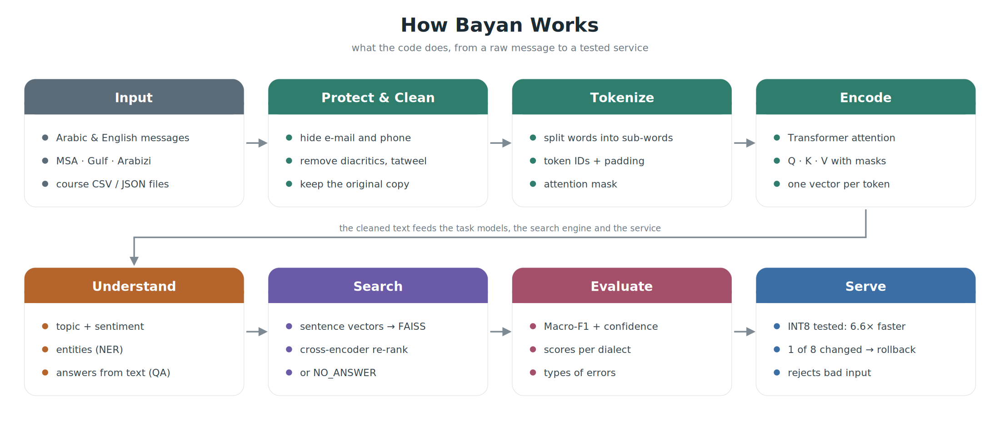
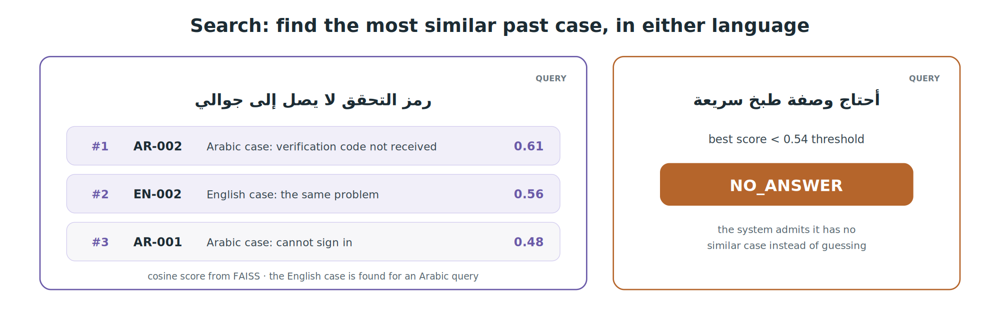
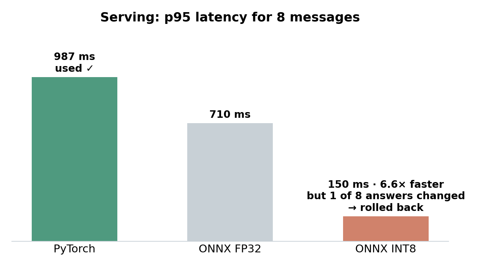

# Bayan — Arabic & English NLP

**Shuruq Alotaibi** · [GitHub: shuruq2](https://github.com/shuruq2) · SDAIA Academy

Bayan reads short service messages in **Arabic** (formal, Gulf dialect, Arabizi) and **English**. It hides personal data, understands the message, finds similar past cases, and returns the result through a tested service.

> The data is small and synthetic (course data), so results show that the pipeline works — not real-world quality.

---

## How It Works

1. **Input** — a message in Arabic or English.
2. **Protect & Clean** — hide e-mail and phone numbers, clean the Arabic text, and keep the original copy.
3. **Tokenize** — split the text into tokens and turn them into numbers.
4. **Encode** — a Transformer (DistilBERT) uses attention to understand each word in context.
5. **Understand** — predict the topic and sentiment, find entities (NER), and answer questions from the text.
6. **Search** — find the most similar past case, even in the other language, or say `NO_ANSWER`.
7. **Evaluate** — measure quality with Macro-F1, confidence intervals and error types.
8. **Serve** — one function that returns the topic and rejects empty or wrong input.

---

## Example: Search

An Arabic question finds the matching **English** case, and an unrelated question gets `NO_ANSWER` instead of a wrong guess.

---

## Results

| Part | Result |
|---|---|
| Search: right case in top 3 | 100 % |
| Search: re-ranking (MRR@3) | 0.67 → **0.72** |
| Arabic ↔ English search | 2 / 2 correct |
| "No answer" in search | 2 / 2 correct |
| Topic (TF-IDF / DistilBERT) | 0.67 / 0.10 |
| Sentiment (TF-IDF / DistilBERT) | 1.00 / 0.43 |
| NER · QA | 0.00 · 0.00 (too little training data) |
| Service tests | Arabic ✔ · English ✔ · invalid input rejected ✔ |

---

## Speed

The INT8 model was **6.6× faster**, but it changed 1 of 8 answers, so the service automatically **went back to the original PyTorch model**.

---

## Extension: Does Arabic Cleaning Help Search?

I ran the same search with raw text and with cleaned Arabic text.

| | Raw text | Cleaned text |
|---|---|---|
| MRR@3 | 0.67 | 0.67 |
| Time per query | 53 ms | 68 ms |

No difference on these 6 test questions. A bigger test set with more spelling variation is needed.
Evidence: [reports/extension_normalisation_ablation.json](reports/extension_normalisation_ablation.json)

---

## Limitations

- The data is very small, so the models could not learn well (NER and QA especially).
- Gulf dialect is harder than formal Arabic; Arabizi is detected but not converted.
- A person must always review the output.

---

## How to Run

Open the notebook in Colab → **Runtime → Run all**. Results are saved in the `reports/` folder.

**Tools:** Python · PyTorch · Hugging Face Transformers · CAMeL Tools · scikit-learn · FAISS · ONNX Runtime

---

## My Contribution
- Combined the course labs into one notebook and edited them.
- Added the BPE vs mBERT comparison, the masking chart, re-ranking evaluation and the ONNX/INT8 benchmark of my own model.

## AI Assistance
I used Claude (AI assistant) to review my notebook, fix the cell order, add QA training and tests, and help write this README and its images. I ran all the code myself and checked the results.

## Credits
This educational project was developed during Applied Natural Language Processing with Transformers (SDA-AIE-211) in the SDAIA Academy training context.

[SDAIA Academy](https://github.com/SDAIAAcademy) · #SDAIAAcademy · Trainer: Meaad Al-Marri — ميعاد المري · Course: https://github.com/almiyead-rgb/bayan-applied-nlp-course

I understand that the version tagged `submission-v1.0` is graded once and cannot be replaced.
